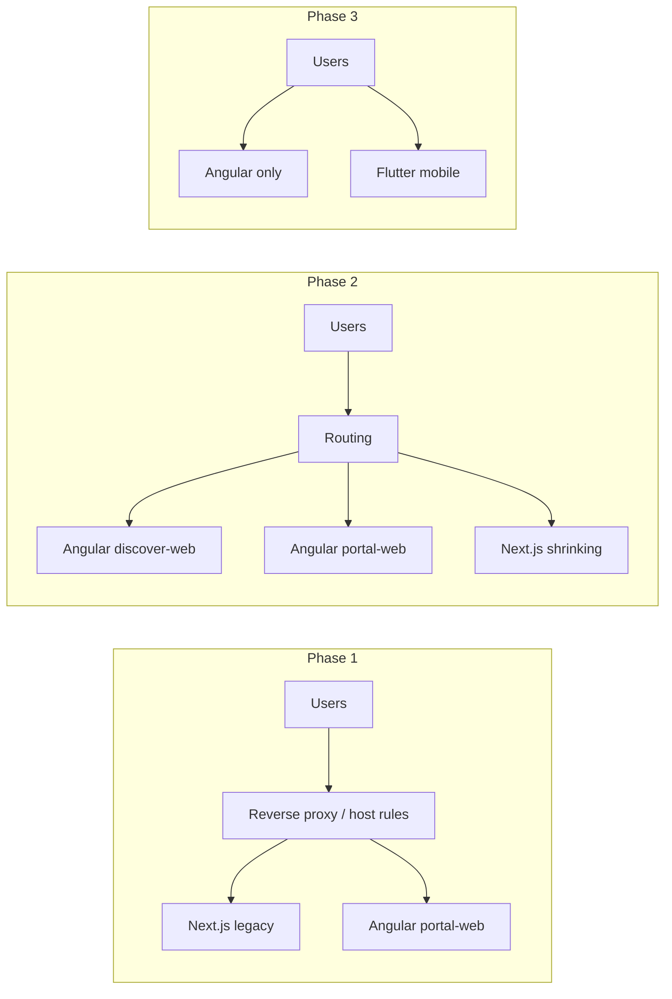

# ADR-012: Angular dual-web (discover + portal) with deferred Flutter mobile

| | |
|---|---|
| **Status** | Proposed |
| **Date** | October 2026 |
| **Deciders** | Solo developer (Aceth / Adeni) |
| **Supersedes** | Partially supersedes [ADR-010](../confluence/system-architecture-v1.2.md) (web + mobile stack) when accepted |
| **Related** | ADR-011 (modular monolith — unchanged), Sprint 20 (LLM Ask Adeni) |

## Context

Adeni’s production clients today:

- **Web:** Next.js (`apps/web`) — public discover, business portal, admin; SEO SSR on key routes; many **Next route handlers** proxy or wrap the .NET API.
- **Mobile:** Expo (`apps/mobile`) — unified customer + business flows.
- **Backend:** .NET modular monolith (`src/Adeni.Api`) — source of truth for domain logic.
- **Shared TS:** `packages/shared`, `packages/api-client`.

The maintainer is a **solo developer** with strong Angular experience, wants:

1. **Two Angular web apps** — discover (SSR/SEO) and business portal (auth-heavy); admin either a third app or a guarded area in portal.
2. **Flutter consumer mobile after web launch** — better native UX; not blocking first web GA.
3. Optional use of **Angular AI / MCP tooling** for development; product **Ask Adeni** remains **API-first** (Sprint 20 LLM + tools).

ADR-010 chose Next + Expo over Flutter for SEO + native mobile. This ADR revisits **implementation** while keeping the same product goals: SEO discovery wedge, business OS, single API.

## Decision

When this ADR is **accepted**, Adeni will:

1. **Adopt Angular (v22+) for all new web UI work**, split into:
   - **`apps/discover-web`** — public discovery, business profiles, booking entry, market context; **SSR/prerender** for SEO routes.
   - **`apps/portal-web`** — Auth0 business user flows (profile, services, calendar, inbox, payments, reviews, settings); optional **admin** lazy routes or **`apps/admin-web`** if isolation is preferred later.
2. **Migrate from Next.js using a strangler pattern** (see [migration checklist](../angular-migration-checklist.md)) — Next remains in production until each route group is replaced and verified; no big-bang cutover required.
3. **Keep Expo in maintenance mode** until web GA; then **build Flutter consumer mobile** against the same OpenAPI/API, launching **after** web launch unless a critical mobile deadline forces overlap.
4. **Do not** use Angular SSR or Flutter web as the primary mobile strategy — store apps are **Flutter (phase 2)**; PWA/mobile web is acceptable only as a **bridge** (e.g. WhatsApp booking links).
5. **Preserve API-first Ask Adeni** — agent tools live on the backend; chat UI is a thin client in discover (Next or Angular during migration).

**Default migration order (recommended):** **portal-web first**, then **discover-web**, then **decommission Next**; aligns with supply-first GTM (business OS before SEO traffic).

Alternative: discover-first if launch gate is SEO-only; document the choice in the checklist when starting.

## Strangler pattern (what we mean)

Named after the [strangler fig](https://martinfowler.com/bliki/StranglerFigApplication.html): the **new system grows around the old one** until the old system can be removed.

For Adeni:

Concrete tactics:

| Tactic | Example |
|--------|---------|
| **Route-level cutover** | `/business/*` → portal-web; `/`, `/discover`, `/businesses/*` stay on Next until discover-web is ready |
| **Shared API** | No duplicate business logic in Angular; use generated or shared client from OpenAPI |
| **BFF replacement** | Each Next `app/api/*` handler is classified: delete (direct API + Auth0 interceptor), or recreate as minimal .NET or gateway endpoint |
| **Feature flags / host headers** | Staging validates Angular routes before DNS/proxy switch |
| **Delete Next last** | Remove `apps/web` only when parity checklist is green |

## Consequences

### Positive

- One web framework (Angular) for discover + portal — aligns with maintainer skills and long-term hiring story.
- Clear deploy boundaries (discover vs portal scale and release independently).
- Flutter mobile can reuse OpenAPI contracts; web GA not blocked on app store cycles.
- Sprint 20 agent work proceeds on API; UI stack migration does not block tool design.

### Negative / risks

- **Temporary two web stacks** (Next + Angular) during strangler — discipline required to avoid double maintenance on every feature.
- **~40 Next BFF routes** must be migrated or eliminated — underestimating this is the main schedule risk.
- **Expo + Flutter overlap** if mobile features continue during Flutter rewrite — policy: freeze Expo features or accept dual mobile briefly.
- ADR-010 Confluence/wiki entries become stale until updated on acceptance.

### Neutral

- Angular MCP / agent skills help **development**; product Ask Adeni still requires backend tools, auth, and observability (App Insights, etc.).

## Alternatives considered

| Option | Why not (for now) |
|--------|-------------------|
| Stay on Next + Expo | Valid; lowest migration cost. Rejected if maintainer velocity is higher on Angular and split apps are desired. |
| Single Angular app (discover + portal) | Simpler repo, worse bundle/blast radius and mixed SEO/auth concerns. |
| Flutter for web discover | Poor SEO/story vs SSR Angular; already rejected in ADR-010 spirit. |
| Capacitor wrapper as “mobile app” | Insufficient as primary consumer app; OK as bridge. |
| Big-bang rewrite | Too risky for solo dev and ongoing Sprint 20 ops work. |

## Acceptance criteria (to move status to Accepted)

- [ ] Maintainer confirms migration order (portal-first vs discover-first).
- [ ] Staging routing plan documented (Azure: Front Door / App Service / Container Apps paths).
- [ ] OpenAPI codegen path chosen for Angular (e.g. `ng-openapi` or shared package strategy).
- [ ] Auth0 applications/callback URLs defined for discover vs portal origins.
- [ ] First Angular app scaffold merged with CI (lint, test, build SSR).

## References

- [Frontend monorepo (current)](../frontend.md)
- [Angular migration checklist](../angular-migration-checklist.md)
- [Product strategy](../product-strategy.md) — supply-first GTM
- [Sprints](../sprints.md) — Sprint 20 Ask Adeni LLM
