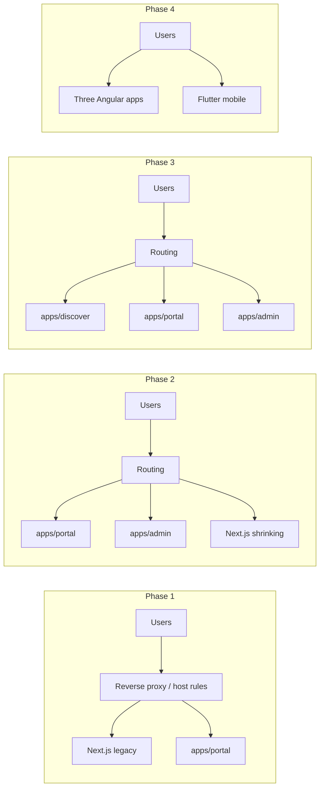

# ADR-012: Angular web (discover + portal + admin) with deferred Flutter mobile

| | |
|---|---|
| **Status** | Accepted |
| **Date** | October 2026 |
| **Deciders** | Solo developer (Aceth / Adeni) |
| **Supersedes** | Partially supersedes [ADR-010](../confluence/system-architecture-v1.2.md) (web + mobile stack) for web clients |
| **Related** | ADR-011 (modular monolith — unchanged), Sprint 20 (LLM Ask Adeni) |

## Context

Adeni’s production clients today:

- **Web:** Next.js (`apps/web`) — public discover, business portal, admin; SEO SSR on key routes; many **Next route handlers** proxy or wrap the .NET API.
- **Mobile:** Expo (`apps/mobile`) — unified customer + business flows.
- **Backend:** .NET modular monolith (`src/Adeni.Api`) — source of truth for domain logic.
- **Shared TS:** `packages/shared`, `packages/api-client`.

The maintainer is a **solo developer** with strong Angular experience, wants:

1. **Three Angular web apps** — discover (SSR/SEO), business portal, and **separate admin** (ops/markets/moderation).
2. **Flutter consumer mobile after web launch** — better native UX; not blocking first web GA.
3. Optional use of **Angular AI / MCP tooling** for development; product **Ask Adeni** remains **API-first** (Sprint 20 LLM + tools).

ADR-010 chose Next + Expo over Flutter for SEO + native mobile. This ADR revisits **implementation** while keeping the same product goals: SEO discovery wedge, business OS, single API.

**Maintainer confirmation (Oct 2026):** Accept strangler migration; repo paths **`apps/discover`**, **`apps/portal`**, **`apps/admin`**.

## Decision

Adeni will:

1. **Adopt Angular (v22+) for all new web UI work**, split into **three deployable apps**:
   - **`apps/discover`** — public discovery, business profiles, booking entry, market context, Ask Adeni UI; **SSR/prerender** for SEO routes.
   - **`apps/portal`** — Auth0 **business** role: profile, services, calendar, inbox, payments, reviews, settings, messaging.
   - **`apps/admin`** — Auth0 **admin** role only: business approval, customers, markets, subscriptions; **no** business-portal features (smaller blast radius, stricter access).
2. **Migrate from Next.js using a strangler pattern** (see [migration checklist](../angular-migration-checklist.md)) — Next remains in production until each route group is replaced and verified; no big-bang cutover required.
3. **Keep Expo in maintenance mode** until web GA; then **build Flutter consumer mobile** against the same OpenAPI/API, launching **after** web launch unless a critical mobile deadline forces overlap.
4. **Do not** use Angular SSR or Flutter web as the primary mobile strategy — store apps are **Flutter (phase 2)**; PWA/mobile web is acceptable only as a **bridge** (e.g. WhatsApp booking links).
5. **Preserve API-first Ask Adeni** — agent tools live on the backend; chat UI is a thin client in **discover** (Next or Angular during migration).

**Migration order (recommended):** **`apps/portal`** → **`apps/admin`** → **`apps/discover`** → decommission Next. Portal first aligns with supply-first GTM; admin is a small, auth-heavy surface that reuses portal patterns; discover last preserves SEO until Angular SSR parity is proven.

## Strangler pattern (what we mean)

Named after the [strangler fig](https://martinfowler.com/bliki/StranglerFigApplication.html): the **new system grows around the old one** until the old system can be removed.

For Adeni:

Concrete tactics:

| Tactic | Example |
|--------|---------|
| **Route-level cutover** | `/business/*` → portal; `/admin/*` → admin; `/`, `/discover`, `/businesses/*` → discover when ready |
| **Shared API** | No duplicate business logic in Angular; use generated or shared client from OpenAPI |
| **BFF replacement** | Each Next `app/api/*` handler is classified: delete (direct API + Auth0 interceptor), or recreate as minimal .NET or gateway endpoint |
| **Feature flags / host headers** | Staging validates Angular routes before DNS/proxy switch |
| **Delete Next last** | Remove `apps/web` only when parity checklist is green |

## Consequences

### Positive

- One web framework (Angular) across discover, portal, and admin — aligns with maintainer skills.
- **Three deploy boundaries** — public SEO, business tenants, and internal ops scale and release independently; admin not bundled with business JS.
- Flutter mobile can reuse OpenAPI contracts; web GA not blocked on app store cycles.
- Sprint 20 agent work proceeds on API; UI stack migration does not block tool design.

### Negative / risks

- **Temporary two web stacks** (Next + Angular) during strangler — discipline required to avoid double maintenance on every feature.
- **Three Auth0 applications** (or one app with multiple callbacks) and **three CI/deploy pipelines** — more ops than two apps.
- **~40 Next BFF routes** must be migrated or eliminated — underestimating this is the main schedule risk.
- **Expo + Flutter overlap** if mobile features continue during Flutter rewrite — policy: freeze Expo features or accept dual mobile briefly.
- ADR-010 Confluence/wiki entries become stale until updated.

### Neutral

- Angular MCP / agent skills help **development**; product Ask Adeni still requires backend tools, auth, and observability (App Insights, etc.).

## Alternatives considered

| Option | Why not |
|--------|---------|
| Stay on Next + Expo | Lowest migration cost; rejected in favor of Angular velocity and split deploys. |
| Single Angular app | Mixed SEO, business, and admin concerns; larger bundles and blast radius. |
| Admin as lazy routes in portal | Rejected — maintainer prefers **`apps/admin`** for isolation and access control. |
| Flutter for web discover | Poor SEO vs SSR Angular; rejected in ADR-010 spirit. |
| Capacitor wrapper as “mobile app” | Insufficient as primary consumer app; OK as bridge. |
| Big-bang rewrite | Too risky for solo dev and ongoing Sprint 20 ops work. |

## Acceptance criteria (execution — checklist)

- [x] Three-app split: `apps/discover`, `apps/portal`, `apps/admin`.
- [x] Migration order: portal → admin → discover (strangler).
- [ ] Staging routing plan documented (Azure: Front Door / App Service / Container Apps paths).
- [ ] OpenAPI codegen path chosen for Angular (e.g. `ng-openapi` or shared package strategy).
- [ ] Auth0 applications/callback URLs defined for **discover**, **portal**, and **admin** origins.
- [x] First Angular app scaffold merged (`apps/portal`, Auth0 SPA + `@adeni/api-client`, dev sub).
- [x] CI job for `npm run build:portal` on PRs (`.github/workflows/ci.yml` → `portal-angular`).

## References

- [Frontend monorepo (current)](../frontend.md)
- [Angular migration checklist](../angular-migration-checklist.md)
- [Product strategy](../product-strategy.md) — supply-first GTM
- [Sprints](../sprints.md) — Sprint 20 Ask Adeni LLM
