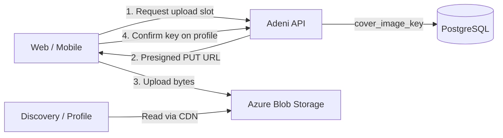

# Media storage

Business photos (cover images, logos) and verification documents must **not** be stored in PostgreSQL. The database holds **references only** — storage keys or public CDN URLs — never binary blobs.

## Recommended architecture



| Layer | Responsibility |
| --- | --- |
| **PostgreSQL** | `cover_image_key` (varchar), optional `logo_image_key`; tenant-scoped, indexed by `tenant_id` |
| **Object storage** | Azure Blob Storage (prod/staging); local filesystem adapter for dev |
| **CDN** | Azure CDN or Cloudflare in front of a public container for discovery cards and profile heroes |
| **API** | `IFileStorage` port — same pattern as CareAxis (`UploadAsync`, `GetDownloadUrlAsync`, `DeleteAsync`) |

## Why not the database?

- Blobs bloat backups and slow replication.
- Images are served millions of times; Postgres is the wrong CDN.
- Direct-to-blob uploads avoid streaming large files through the API (cost, timeout, memory).
- SOC 2: separation of PII DB from static assets simplifies retention and purge.

## Upload flow (Sprint 12 target)

1. `POST /api/v1/tenant/media/upload-url` — body: `{ purpose: "cover", contentType: "image/jpeg", contentLength }`
2. API validates tenant auth, size (e.g. ≤ 5 MB), and MIME allow-list (`image/jpeg`, `image/png`, `image/webp`).
3. API returns `{ uploadUrl, storageKey, expiresAt }` — short-lived SAS (5–15 min).
4. Client `PUT` file directly to blob.
5. `PATCH /api/v1/tenant/profile` with `{ coverImageKey }` — API verifies key prefix `tenants/{tenantId}/`.
6. Public read: API resolves key → CDN URL in discovery/profile DTOs as `coverImageUrl`.

## Path convention

```
tenants/{tenantId}/covers/{uuid}.webp
tenants/{tenantId}/logos/{uuid}.webp
tenants/{tenantId}/verification/{uuid}.pdf   # private container, signed URLs only
```

- **Public container**: cover + logo (immutable UUID filenames; overwrite = new key).
- **Private container**: verification docs (admin-only signed download).

## Client fallback (Sprint 11)

Until upload ships, UI uses `resolveBusinessCoverImage(categorySlug, coverImageUrl)` — category Unsplash placeholders when `coverImageUrl` is null.

## Dev vs prod

| Env | Adapter | Public base URL |
| --- | --- | --- |
| Local | `LocalFileStorage` → `./.data/media` | `http://localhost:5169/media/...` or static file middleware |
| Staging / Prod | `AzureBlobFileStorage` | `https://media.adeni.app/...` (CDN) |

Config section: `Storage:Provider` = `Local` | `AzureBlob`, plus connection string / managed identity.

## Related work

- Sprint 11: category placeholder heroes on discovery cards + business profiles ✅
- Sprint 12: `IFileStorage`, migration `cover_image_key`, upload URL endpoint, portal UI
