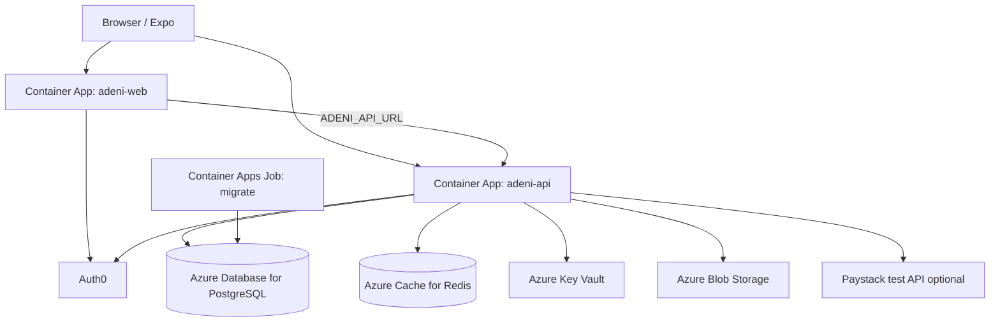

# QA / staging deploy runbook (Azure Container Apps)

**Goal:** One shared environment for product QA — real Auth0, Postgres, Redis, no dev auth headers — without calling it production.

**Scope (QA v1):** Discover → book → business inbox → admin verify → optional stub/Paystack test payments. Mobile can point at the same API later.

**Out of scope for QA v1:** LLM agents (Sprint 20), WhatsApp messaging (18), full observability dashboards (enable App Insights when ready).

Related: [auth0-setup.md](../auth0-setup.md), [database-setup.md](../database-setup.md), [caching-setup.md](../caching-setup.md), [observability.md](../observability.md), [web-testing-checklist.md](../web-testing-checklist.md), [payments.md](../payments.md), [media-storage.md](../media-storage.md).

---

## 1. Architecture (Azure Container Apps)



| Component | Azure service | Notes |
|-----------|---------------|--------|
| API | **Container App** `adeni-api-qa` | `ASPNETCORE_ENVIRONMENT=Staging`, port 8080, health `/health` |
| Web | **Container App** `adeni-web-qa` | Next.js standalone image, port 3000 |
| DB | **PostgreSQL Flexible Server** | Single DB `adeni`; private access preferred |
| Cache | **Azure Cache for Redis** | Required — slot locks + discovery cache |
| Secrets | **Key Vault** | Required when not Development — see `KeyVault:Uri` |
| Media | **Storage account + blob** | Set `Storage:Provider=AzureBlob` for QA |
| Ingress | **Custom domains** | e.g. `https://qa.adeni.io`, `https://api-qa.adeni.io` |
| Migrations | **Container Apps Job** (or one-off `dotnet ef`) | **Not automatic in Staging** — see §5 |

**Repo gap today:** No `Dockerfile` in repo yet. Add before first deploy:

- `src/Adeni.Api/Dockerfile` — multi-stage `dotnet publish`
- `apps/web/Dockerfile` — `output: 'standalone'` in `next.config.ts`, then `node server.js`
- CI workflow to build/push to **Azure Container Registry (ACR)**

---

## 2. Environments and branches

| Environment | Git source | ASP.NET env | Auth |
|-------------|------------|-------------|------|
| Local | `dev` | Development | Auth0 off + dev subs OK |
| **QA** | `main` or tagged release from `dev` | **Staging** | Auth0 on, **no** dev middleware |
| Production | `main` tags | Production | Same as QA, stricter change control |

**Recommendation:** Merge `dev` → `main` when CI is green; deploy QA from `main` (or `qa` branch that tracks release candidates).

Remote: `https://github.com/acethsol/adeni.git` — default branch on GitHub is **`main`**; active feature work may be on **`dev`**.

---

## 3. Pre-deploy checklist (application)

- [ ] `dotnet test Adeni.slnx -c Release` passes (matches [CI](../../.github/workflows/ci.yml))
- [ ] `npm run typecheck` (root) passes
- [ ] No secrets in git (`.env.local`, Paystack keys, Auth0 secrets → Key Vault / ACA secrets)
- [ ] Migrations committed under `src/Adeni.Infrastructure/Persistence/Migrations/`
- [ ] [web-testing-checklist.md](../web-testing-checklist.md) Section D smoke passes against **QA URLs** after deploy

---

## 4. Auth0 (QA tenant)

Use a dedicated Auth0 tenant or separate QA applications in the same tenant.

1. **API** identifier: `https://api.adeni.io` (or QA-specific audience if you split — must match `Auth0:Audience` on API and web).
2. **Regular Web Application** (Next.js):
   - Callback: `https://<qa-web-host>/auth/callback`
   - Logout: `https://<qa-web-host>`
   - Web origins: `https://<qa-web-host>`
3. **Native app** (mobile QA builds): add Expo callback URLs when testing mobile against QA.
4. Login Action: inject `https://adeni.io/` claims — [auth0-setup.md](../auth0-setup.md).
5. Admin MFA: `Auth0:RequireMfaForAdmin=true` + Auth0 Action — [mfa-enforcement.md](../mfa-enforcement.md).

**Do not set** `DEV_CUSTOMER_AUTH0_SUB` / `DEV_BUSINESS_AUTH0_SUB` on QA web. Dev middleware only runs when `Auth0:Enabled=false` on the API (Development/Testing only).

Create QA test users:

- Customer (book, my-bookings, reviews)
- Business owner linked to a verified tenant (`app_metadata.tenant_id`)
- Admin (`admin` role + MFA)

---

## 5. Database and seed (critical)

**Staging does not auto-migrate or auto-seed.** Only **Development** runs `MigrateAsync` + `DevelopmentDataSeeder` in [Program.cs](../../src/Adeni.Api/Program.cs).

### 5.1 Run migrations (every deploy with schema changes)

From a machine with network access to QA Postgres, or a **Container Apps Job** using the API image:

```powershell
$env:ConnectionStrings__AdeniDb = "<qa-postgres-connection-string>"
dotnet ef database update `
  --project src/Adeni.Infrastructure `
  --startup-project src/Adeni.Api
```

Or run the same command in CI/CD after deploy approval.

### 5.2 QA data strategy (pick one)

| Option | When to use |
|--------|-------------|
| **A. Minimal manual** | Register business via `/business/register`, admin approve, add services/availability |
| **B. One-time dev seeder against QA** | Temporarily run seeder logic from a controlled script/job (not recommended on shared QA without wipe policy) |
| **C. SQL snapshot / restore** | Restore a known-good QA baseline after schema migrate |

Document chosen option in your team wiki. For demos, ensure at least one **verified** slug (e.g. `lekki-cuts`) with services + availability + optional deposit %.

**Do not** rely on the full ~1000-business dev bulk seed in QA unless you explicitly want load testing.

---

## 6. Configuration reference

### 6.1 API (`Staging` / environment variables)

| Key | QA value |
|-----|----------|
| `ASPNETCORE_ENVIRONMENT` | `Staging` |
| `KeyVault:Uri` | `https://<vault>.vault.azure.net/` |
| `ConnectionStrings:AdeniDb` | Key Vault secret |
| `Redis:ConnectionString` | Key Vault secret |
| `Auth0:Enabled` | `true` |
| `Auth0:Domain` | Your Auth0 domain |
| `Auth0:Audience` | API identifier |
| `Auth0:RequireMfaForAdmin` | `true` |
| `Cors:AllowedOrigins:0` | `https://<qa-web-host>` |
| `Market:DefaultTimeZoneId` | `Africa/Lagos` |
| `Observability:Enabled` | `true` (when App Insights connection string set) |
| `Storage:Provider` | `AzureBlob` (recommended) |
| `Payments:Provider` | `Stub` for QA UI tests, or `Paystack` with **test** keys |
| `Paystack:WebhookSecret` | Paystack QA webhook → `https://api-qa.../api/v1/payments/webhook` |

Base template: [appsettings.Staging.json](../../src/Adeni.Api/appsettings.Staging.json).

**Managed identity:** Container App system-assigned MI needs **Key Vault Secrets User** (and blob data roles if using Azure Storage).

### 6.2 Web (Container App env)

Copy from [apps/web/.env.local.example](../../apps/web/.env.local.example) — set in ACA, not in git:

| Variable | QA |
|----------|-----|
| `APP_BASE_URL` | `https://<qa-web-host>` |
| `ADENI_API_URL` | `https://<qa-api-host>` (server-side fetch + rewrites) |
| `NEXT_PUBLIC_ADENI_API_URL` | Same public API URL if client calls API directly |
| `AUTH0_*` | QA Regular Web Application |
| `NEXT_PUBLIC_ADENI_MARKET` | `lagos` (optional default) |

Remove all `DEV_*_AUTH0_SUB` variables.

---

## 7. Azure Container Apps — suggested setup

### 7.1 Resource group (example)

- `rg-adeni-qa-canadacentral` (or Nigeria region when available for latency tests)

### 7.2 Core resources

1. **Log Analytics workspace** + **Container Apps Environment**
2. **ACR** `acradeniqa` — admin disabled; ACA pull via MI
3. **PostgreSQL Flexible Server** — TLS required; firewall / VNet integration
4. **Azure Cache for Redis** — TLS port 6380
5. **Key Vault** — secrets listed in §6
6. **Storage account** — containers per [media-storage.md](../media-storage.md)

### 7.3 Container Apps

**API**

- Image: `acradeniqa.azurecr.io/adeni-api:<git-sha>`
- Target port: **8080** (`ASPNETCORE_URLS=http://+:8080`)
- Probes: `GET /health` (liveness + readiness)
- Min replicas: 1 (QA); max: 2
- Ingress: external, HTTPS, custom domain `api-qa...`

**Web**

- Image: `acradeniqa.azurecr.io/adeni-web:<git-sha>`
- Target port: **3000**
- Ingress: external, HTTPS, custom domain `qa...`
- Env: §6.2

**Migration job** (manual or pipeline step)

- Same API image, command: `dotnet ef database update ...` or a small `Adeni.Migrate` console project
- Run on each release before switching traffic

### 7.4 Paystack webhook (if testing Sprint 17)

Public URL must reach API ingress. Register in Paystack dashboard (test mode). See [specs/sprint-17-paystack-commerce.md](../specs/sprint-17-paystack-commerce.md) § Configuration.

### 7.5 Redis cache invalidation

After catalog/capability JSON changes, flush profile keys if needed:

```text
adeni:location:<slug>:profile
```

(See [caching-setup.md](../caching-setup.md).)

---

## 8. Post-deploy smoke (QA)

Run from your machine (replace hosts):

```powershell
Invoke-RestMethod https://api-qa.<domain>/health
Invoke-RestMethod "https://api-qa.<domain>/api/v1/discovery?marketId=lagos&lat=6.5244&lng=3.3792"
```

Browser:

1. `https://qa.<domain>/discover` — list loads, infinite scroll without duplicate-key errors
2. Sign in (Auth0) → `/businesses/<slug>` → book → **My bookings**
3. Business portal → inbox accept/reject
4. Admin → approve a test tenant (MFA)
5. Optional: deposit → stub checkout → receipt

Full matrix: [web-testing-checklist.md](../web-testing-checklist.md).

---

## 9. CI/CD (next increment)

Today: [.github/workflows/ci.yml](../../.github/workflows/ci.yml) — build + test on `main` PRs; **no deploy**.

Recommended follow-up:

1. Build and push Docker images to ACR on `main` merge
2. Deploy to ACA with revision labels (`qa-<sha>`)
3. Run migration job gate before `100%` traffic
4. Optional: GitHub Environment `qa` with approval

---

## 10. Rollback

- Container Apps: activate previous **revision**
- Database: forward-only migrations; rollback = forward fix migration, not `ef database update` down in QA unless planned

---

## 11. Open engineering tasks (before first QA deploy)

| Task | Owner |
|------|--------|
| Add API + Web Dockerfiles and `next.config` `output: 'standalone'` | Eng |
| ACA + ACR + Postgres + Redis + KV provisioning (Bicep/Terraform optional) | Eng / DevOps |
| Migration job in pipeline | Eng |
| QA Auth0 apps + test users | Eng / PM |
| Decide QA seed strategy (§5.2) | PM |
| GitHub branch protection + environments — [git-repo-diligence.md](./git-repo-diligence.md) | Eng |
